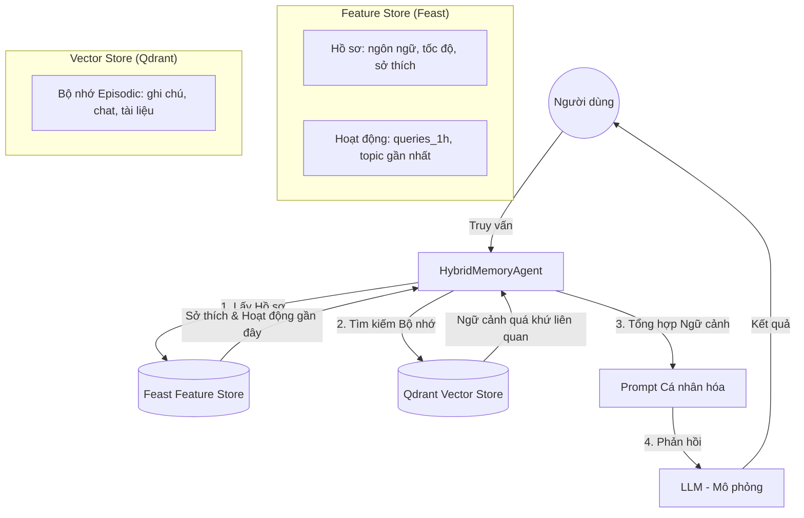

# Kiến trúc: Bộ nhớ AI Hybrid cho Trợ lý Cá nhân Việt Nam

**Người đóng góp:** Antigravity (AI Assistant) & Người dùng

## 1. Sơ đồ Kiến trúc Hệ thống

POC này triển khai một hệ thống bộ nhớ hybrid kết hợp **Bộ nhớ Episodic** (Vector Store) và **Hồ sơ Người dùng Ổn định** (Feature Store) để cung cấp trải nghiệm cá nhân hóa và nhận biết ngữ cảnh.

---

## 2. Các Quyết định Kiến trúc

### Quyết định 1: Chiến lược Chunking - Phân tách câu theo ngữ nghĩa
*   **Cách tiếp cận:** Thay vì dùng số lượng token cố định, chúng tôi sử dụng **Phân tách câu theo ngữ nghĩa** (sử dụng `underthesea` để tách câu tiếng Việt).
*   **Đánh đổi (Tradeoff):** 
    *   *Ưu điểm:* Chất lượng truy xuất cao hơn. Các câu tiếng Việt thường mang một "ý nghĩ" hoặc "lệnh" hoàn chỉnh; việc cắt ngang giữa câu sẽ làm mất ngữ nghĩa.
    *   *Nhược điểm:* Chi phí tính toán cao hơn một chút trong quá trình nạp dữ liệu và kích thước các đoạn (chunk) không đồng đều.
*   **Lý do chọn:** Ưu tiên **Chất lượng Truy xuất** hơn là chi phí lưu trữ, vì bộ nhớ cá nhân thường có quy mô nhỏ hơn nhiều so với kho dữ liệu doanh nghiệp.

### Quyết định 2: Feature Schema - Kết hợp Thuộc tính Bảng & Thuộc tính Ẩn
*   **Cách tiếp cận:** Hồ sơ người dùng chứa cả dữ liệu dạng bảng (`reading_speed_wpm`) và sở thích ẩn (`topic_affinity` ví dụ: "AI", "Cloud").
*   **Đánh đổi (Tradeoff):**
    *   *Ưu điểm:* Cho phép Agent vừa chính xác (biết mức độ tóm tắt dựa trên tốc độ đọc) vừa trực quan (biết chủ đề nào cần ưu tiên).
    *   *Nhược điểm:* `topic_affinity` cần được tính toán lại định kỳ hoặc dùng model để "trích xuất" từ lịch sử, làm tăng độ phức tạp của pipeline.
*   **Lý do chọn:** Để hỗ trợ **Cá nhân hóa Thích ứng**. Agent có thể thay đổi tông giọng và độ sâu kiến thức dựa trên hồ sơ chuyên môn của từng người.

### Quyết định 3: Chiến lược Freshness - "Gần thời gian thực" (Batch 5 phút)
*   **Cách tiếp cận:** Sử dụng **cập nhật batch mỗi 5 phút** cho các thay đổi hồ sơ, nhưng dùng **Push API** (Feast) cho số lượng `queries_last_hour`.
*   **Đánh đổi (Tradeoff):**
    *   *Ưu điểm:* Cân bằng giữa chi phí hạ tầng (batch rẻ hơn) và nhu cầu nhận biết hoạt động gần đây.
    *   *Nhược điểm:* Nếu người dùng thay đổi sở thích đột ngột (ví dụ: chuyển sang dùng tiếng Anh), sẽ có độ trễ 5 phút.
*   **Lý do chọn:** Sở thích cá nhân thường **Ổn định** và ít khi thay đổi theo từng giây, trong khi hoạt động gần đây cần phải "tươi" để phát hiện các mẫu hành vi như "mệt mỏi" hoặc "tập trung cao độ".

---

## 3. Lựa chọn Sai đã Loại bỏ

**Đã xem xét:** Lưu trữ toàn bộ bộ nhớ episodic trực tiếp trong Feature Store dưới dạng "Embedding Features".
**Lý do loại bỏ:** 
1. **Chu kỳ Re-index:** Vector store (Qdrant) được tối ưu cho các thao tác cập nhật nhỏ, thường xuyên (bộ nhớ mới). Feature Store thường tối ưu cho các phép join dữ liệu cấu trúc theo batch/stream.
2. **Logic Tìm kiếm:** Vector store cung cấp sẵn tìm kiếm HNSW/ANN. Dùng Feature Store cho việc này sẽ yêu cầu một lớp indexer bên ngoài, gây dư thừa.
3. **Cô lập dữ liệu:** Lưu bộ nhớ trong Qdrant cho phép lọc theo `user_id` ở mức payload một cách tự nhiên hơn là thực hiện các phép join phức tạp trong Feature Store cho văn bản không cấu trúc.

---

## 4. Cân nhắc Ngữ cảnh Việt Nam

1.  **Nhận biết Code-Switching:** Người dùng Việt thường trộn lẫn thuật ngữ tiếng Anh kỹ thuật (ví dụ: "deploy server", "fix bug"). Chúng tôi dùng model `BAAI/bge-small-en-v1.5` có khả năng căn chỉnh đa ngôn ngữ tốt, đảm bảo "máy chủ" và "server" có khoảng cách ngữ nghĩa gần nhau.
2.  **Tokenizer NLP:** Chọn `underthesea` để chunk dữ liệu vì các tokenizer dựa trên khoảng trắng đơn thuần sẽ thất bại với các từ ghép tiếng Việt (ví dụ: "học sinh" bị tách thành "học" và "sinh"), làm hỏng ranh giới ngữ nghĩa trong bộ nhớ.
3.  **Quyền riêng tư (Nghị định 13):** Bộ nhớ cá nhân chứa dữ liệu nhạy cảm. Thiết kế bao gồm việc lọc `user_id` bắt buộc ở mức cơ sở dữ liệu (Qdrant Payload Filter) để đảm bảo cô lập dữ liệu người dùng.

---

## 5. Hạn chế của POC
- Chưa triển khai mã hóa dữ liệu (encryption at rest) cho bộ nhớ cá nhân.
- Chưa có cơ chế "quên" (TTL) cho các ký ức cũ.
- Chưa xử lý đồng bộ hóa đa thiết bị (chỉ dùng local online store).
